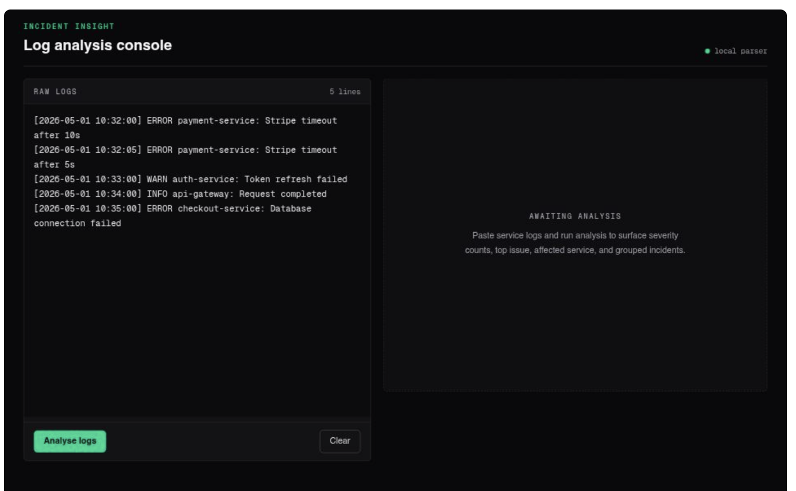

# Incident Insight Dashboard

Raw logs are noisy and hard to read. This tool surfaces repeated issues and highlights what actually matters.

Grouping is done using fingerprint normalisation to collapse similar log messages with dynamic values into a single issue.

## Live

https://ai-support-assistant-omega.vercel.app/

## What this is

This is a small tool that takes raw application logs and turns them into something actually useful.

Instead of reading through hundreds of lines manually, it groups repeated issues, shows severity breakdown, and highlights what’s going wrong and where.

## What it does

* Parses raw logs into structured data
* Normalises messages so similar errors are grouped together
* Counts severity levels (ERROR, WARN, etc)
* Identifies the most common issue
* Shows which service is most affected
* Lets you filter issues by severity

## How it works (simple version)

Raw logs go through a pipeline:

```
split → parse → normalise → group → sort → summarise
```

The key part is fingerprinting.

Example:

```
Stripe timeout after 5s
Stripe timeout after 10s
```

Both become:

```
stripe timeout after {number}s
```

So they get grouped as the same issue.

## Tech

* Next.js (App Router)
* TypeScript
* Tailwind
* Jest (for testing the analysis logic)

## Running locally

```bash
npm install
npm run dev
```

Open:

```
http://localhost:3000
```

Run tests:

```bash
npm test
```

## What I focused on

This project is mainly about data handling, not just UI.

I wanted to:

* take messy input and structure it properly
* group similar problems reliably
* surface useful information quickly
* keep the UI simple and functional

## What I learned

* Breaking problems down into transformation steps
* Grouping and counting patterns in real data
* Writing logic that’s testable, not just “works in the UI”
* Building something end-to-end instead of just frontend screens

## Notes

This is not connected to a real logging system or database. It’s designed to demonstrate the logic behind analysing logs rather than integrating with external services.
## Preview

